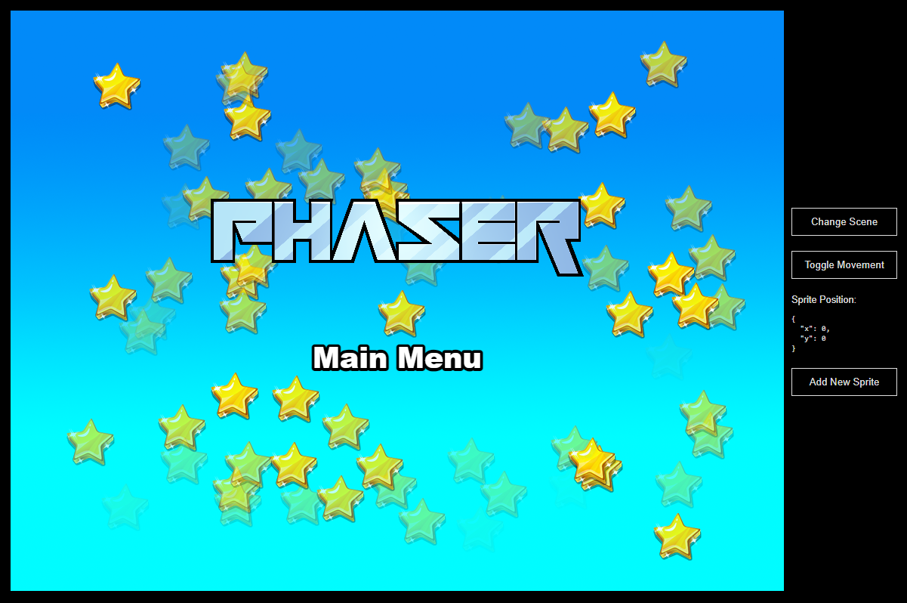

# Plantilla Phaser React

Esta es una plantilla de proyecto Phaser 3 que utiliza el framework React y Vite para la agrupación. Incluye un puente para la comunicación entre React y el juego Phaser, recarga en caliente para un flujo de trabajo de desarrollo rápido y scripts para generar compilaciones listas para producción.

**[Esta plantilla también está disponible en una versión TypeScript.](https://github.com/phaserjs/template-react-ts)**

### Versiones

Esta plantilla ha sido actualizada para:

- [Phaser 3.85.2](https://github.com/phaserjs/phaser)
- [React 18.3.1](https://github.com/facebook/react)
- [Vite 5.3.1](https://github.com/vitejs/vite)

## Requisitos

[Node.js](https://nodejs.org) es necesario para instalar dependencias y ejecutar scripts a través de `npm`.

## Comandos Disponibles

| Comando | Descripción |
|---------|-------------|
| `npm install` | Instalar dependencias del proyecto |
| `npm run dev` | Iniciar un servidor web de desarrollo |
| `npm run build` | Crear una compilación de producción en la carpeta `dist` |
| `npm run dev-nolog` | Iniciar un servidor web de desarrollo sin enviar datos anónimos (ver "Acerca de log.js" a continuación) |
| `npm run build-nolog` | Crear una compilación de producción en la carpeta `dist` sin enviar datos anónimos (ver "Acerca de log.js" a continuación) |

## Escribiendo Código

Después de clonar el repositorio, ejecuta `npm install` desde tu directorio de proyecto. Luego, puedes iniciar el servidor de desarrollo local ejecutando `npm run dev`.

El servidor de desarrollo local se ejecuta en `http://localhost:8080` por defecto. Por favor, consulta la documentación de Vite si deseas cambiar esto o agregar soporte SSL.

Una vez que el servidor esté en funcionamiento, puedes editar cualquiera de los archivos en la carpeta `src`. Vite recompilará automáticamente tu código y luego recargará el navegador.

## Estructura del Proyecto de Plantilla

Hemos proporcionado una estructura de proyecto predeterminada para que comiences. Esto es lo siguiente:

- `index.html` - Una página HTML básica para contener el juego.
- `src` - Contiene el código fuente del cliente React.
- `src/main.jsx` - El punto de entrada principal de **React**. Esto inicia la aplicación React.
- `src/App.jsx` - El componente principal de React.
- `src/game/PhaserGame.jsx` - El componente React que inicializa el juego Phaser y sirve como un puente entre React y Phaser.
- `src/game/EventBus.js` - Un bus de eventos simple para comunicar entre React y Phaser.
- `src/game` - Contiene el código fuente del juego.
- `src/game/main.jsx` - El punto de entrada principal del **juego**. Esto contiene la configuración del juego y lo inicia.
- `src/game/scenes/` - Las escenas de Phaser están en esta carpeta.
- `public/style.css` - Algunas reglas CSS simples para ayudar con el diseño de la página.
- `public/assets` - Contiene los recursos estáticos utilizados por el juego.

## Puente React

El componente `PhaserGame.jsx` es el puente entre React y Phaser. Inicializa el juego Phaser y pasa eventos entre los dos.

Para comunicar entre React y Phaser, puedes usar el archivo **EventBus.js**. Este es un bus de eventos simple que te permite emitir y escuchar eventos tanto desde React como desde Phaser.

